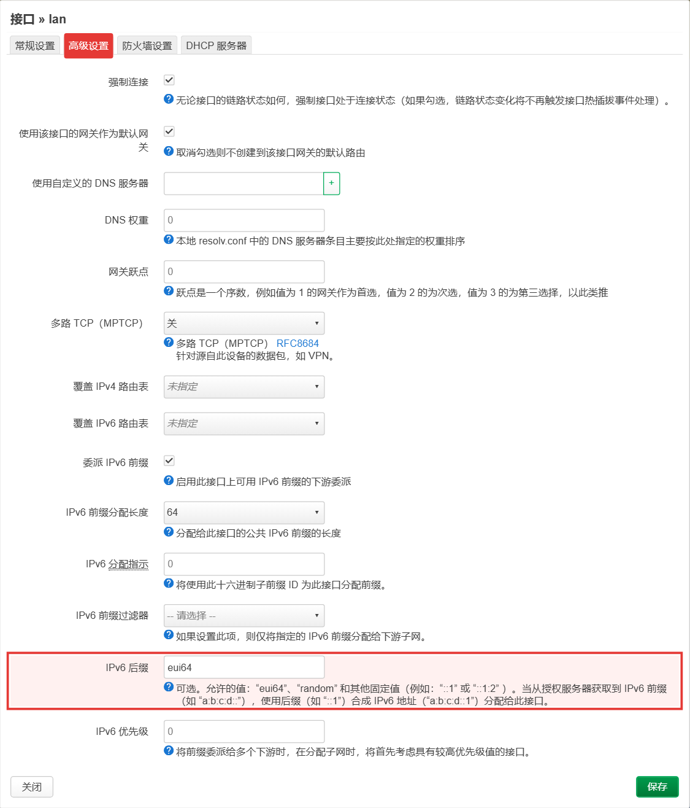
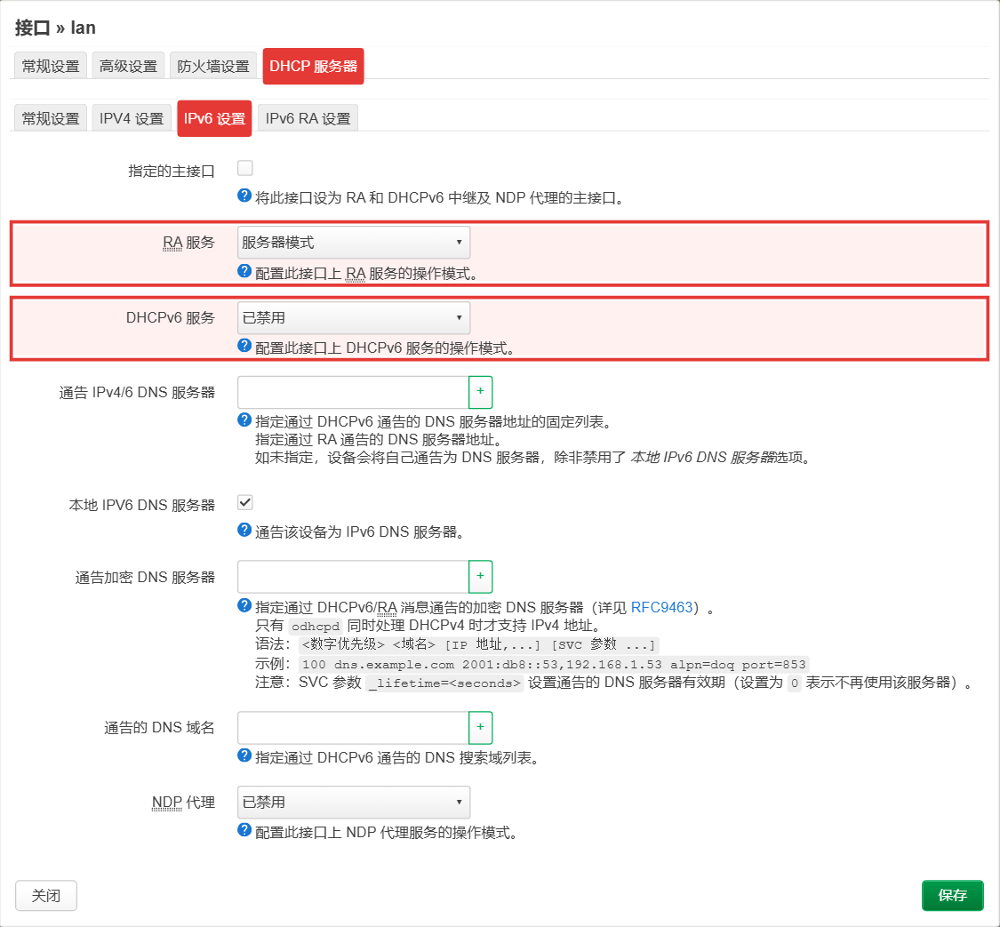
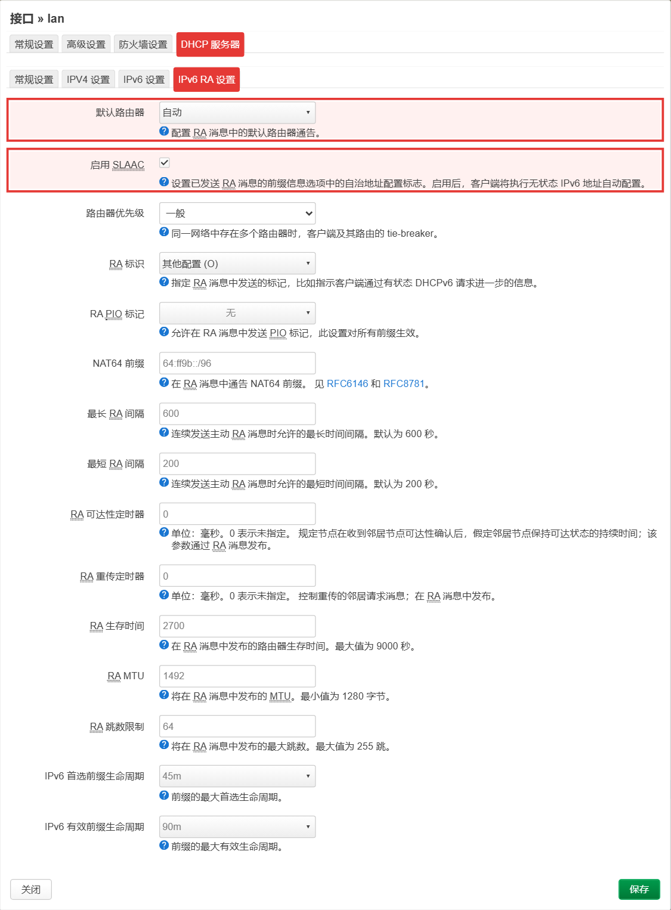
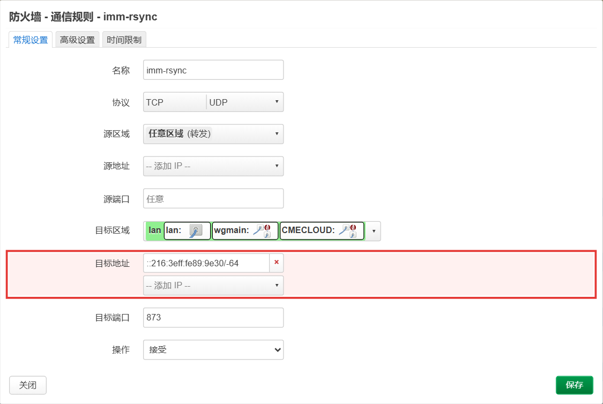

# ImmortalWrt 常见问题指北

这是一篇常见问题指南，帮助你更好地使用 ImmortalWrt。

**关于版本**：本文适用于 ImmortalWrt 23.05 / 24.10 / 25.12。涉及软件包安装命令的地方请注意版本差异 —— **24.10 及更早是 `opkg`，25.12（含 master 快照）改成了 `apk`**，详见 [README](./README.md) 的「版本与命令对照」。

**本文使用的图例说明**

> [!NOTE]
> 对正文的补充说明。

> [!TIP]
> 经验与技巧，照着做可以少走弯路。

> [!IMPORTANT]
> 容易踩坑、需要特别注意的地方。

---

### 1. 为什么用不了 SSRP

23.05 之后 ImmortalWrt 用 `nftables` 替换了 `iptables`，所以一些基于 `iptables` 的插件（如 SSRP、turbo-acc 等）无法使用。请改用 `homeproxy` 之类的替代方案。

### 2. 我的 PassWall 有问题

PassWall 的使用问题不在本群的支持范围，请到 PassWall 社区获取帮助：[Openwrt-Passwall/openwrt-passwall/issues](https://github.com/Openwrt-Passwall/openwrt-passwall/issues)

### 3. 我的设备莫名重启

检查一下你是否使用了 SFE 转发加速。如果有，请禁用，并重新刷入一个不带 SFE 的固件。

### 4. 设备能获取到 IPv6 但是无法通过 IPv6 上网

请**不保留配置**，干净地重新刷入一个不包含任何 MWAN 和多拨插件的固件。

### 5. 如何优雅的使用 IPv6？

> [!TIP]
> 请使用专门针对国内 IPv6 环境做过优化的 ImmortalWrt **23.05.1 以及更新的版本**（24.10 / 25.12 同样适用）。

要让内网设备用上"前缀会变、后缀不变"的地址，只需要做两件事：

**① 让 LAN 下发的地址使用 EUI-64 后缀**

`网络 → 接口 → LAN → 高级设置`，把 **`IPv6 后缀` 设为 `eui64`**，顺手确认 `IPv6 分配长度` 为 `64`：



**② 确认 RA / DHCPv6 正常下发**

`网络 → 接口 → LAN → DHCP 服务器 → IPv6 设置`（`RA 服务` 用「服务器模式」）和 `IPv6 RA 设置`（勾选「启用 SLAAC」），一般保持默认即可：





> [!NOTE]
> 为什么要这么设、EUI-64 后缀是怎么由 MAC 算出来的、前缀是哪来的，见 [关于 eui64 的一些说明](./关于eui64的一些说明.md)。

### 6. IPv6 如何正确配置端口转发？

IPv6 **不需要**你去固定设备的地址。只要设备用的是 EUI-64 后缀，就在 `网络 → 防火墙 → 通信规则` 里加一条规则，把「目标地址」写成带掩码的形式（前缀任意、后缀固定）：

```
::216:3eff:fe89:9e30/-64
```

（等价写法：`::216:3eff:fe89:9e30/::ffff:ffff:ffff:ffff`，两种写法 LuCI 都接受）

这样运营商换了前缀也不用改规则，之后就能通过 `你的前缀 + 设备 EUI-64 后缀`（+ 端口）访问它。



原理说明见 [关于 eui64 的一些说明](./关于eui64的一些说明.md)。

### 7. 我应当在路由器上开启 BBR 吗？

不应当。

### 8. 我的米家设备使用不正常了

请在你路由器上的广告拦截插件里，把小米相关的规则设置为放行。

### 9. 我编译出错了

我们不建议新手用户自行编译 ImmortalWrt，请优先使用**在线构建（firmware selector）**：

- 官方：[firmware-selector.immortalwrt.org](https://firmware-selector.immortalwrt.org)
- 使用说明：[ImmortalWrt 在线构建服务 使用说明](https://github.com/1715173329/blog/issues/9)

> [!NOTE]
> 目前最新稳定版是 **25.12**（25.12.2），上一稳定版是 24.10（24.10.6）。在线构建时记得选择与设备对应的版本。

### 10. 我家里的苹果设备耗电快

请检查家里是否有使用小米路由器，如果有请替换掉；再确认是否开启了 BBR，如果开了请关闭；最后在所有带分流功能的插件里，把苹果相关的服务全部设置为直连。

### 11. 在一些网站上它显示我的 DNS 泄露了，我需要做任何措施吗？

不需要对所谓的 DNS 泄露做任何处理 —— 出现所谓的泄露，恰好说明你的分流插件在正常工作。

> [!TIP]
> 在群里问任何有关 DNS 泄露的问题会被踢，望周知。

### 12. 如何开启 UPnP？

请确保你拥有公网 IPv4 地址，然后在 `服务 → UPnP` 里勾选 **启动 UPnP 与 NAT-PMP 服务**。

> [!NOTE]
> 启用之后列表里不显示已经打洞成功的程序属**正常现象**。

### 13. 为什么我找不到 wireguard 了？

在新版本内核里，`luci-app-wireguard` 已被合并为内核模块，请在编译 / 构建时添加以下软件包：

```
wireguard-tools
kmod-wireguard
luci-proto-wireguard
```

已经刷好固件的设备也可以在线安装：

```sh
# 24.10 及更早
opkg update && opkg install wireguard-tools kmod-wireguard luci-proto-wireguard
# 25.12 / 快照
apk update && apk add wireguard-tools kmod-wireguard luci-proto-wireguard
```

> [!IMPORTANT]
> `kmod-*` 包是**和内核版本绑定的**：升级固件（内核版本变化）之后，之前装的 kmod 包需要重新安装一次，否则会提示内核不匹配。

### 14. 当 Wireguard 的服务器端是动态 IP，我应该怎么配置自动更新对端 IP？

客户端配置好 Wireguard 之后，在 `系统 → 计划任务` 里添加：

```
*/2 * * * * /usr/bin/wireguard_watchdog
```

### 15. 为什么我在 DDNS 插件里找不到我的提供商？

请在 `系统 → 软件包`（25.12 上菜单名相同）里搜索并安装 `ddns-scripts-提供商名字`，例如 `ddns-scripts-cloudflare`。

> [!NOTE]
> 如果更新软件包列表后也搜不到，那就说明确实不支持。另外也可以改用 `luci-app-ddns-go`（ddns-go 前端），它自带一批国内厂商的接口。

### 16. 为什么 scp 命令报错？

新版 OpenSSH 的 scp 默认使用 SFTP 协议，但 OpenWrt/ImmortalWrt 上的 Dropbear 自身无 SFTP 支持。

解决方案（任选其一）：

- 使用 `scp -O` 指定使用传统 SCP 协议
- 在 ImmortalWrt 上安装 `openssh-sftp-server`

### 17. i225/i226 网卡还会断流吗？

这个问题已于 **23.05.0** 正式版开始被修复。

> [!NOTE]
> 如果你的设备（特别是四口的）网卡部分没有做差分等长布线，这个补丁将不对你起作用。我们收到的多数报告与这个问题有关。另外，网线质量也会造成"掉线"，遇到断流建议先换一根网线排除。

### 18. 为什么我网络在使用 BT / PCDN 等应用时有时候会莫名其妙断流 / 变慢？

按下面顺序排查：

1. 检查你是否在使用中兴 7615v1 等 zxic 方案的光猫 —— 这类光猫在大连接数场景下需要更新光猫固件才能稳定桥接；
2. 检查你是否在使用中兴 F6005 / VSOL / HSGQ 光猫 —— 这类光猫用的是 RTL 的 300MHz 单核 MIPS CPU 方案，无法支撑大连接数桥接；
3. 检查你获取到的 IP 是否为私网 IP —— 在 CGNAT 的情况下，私网 IP 的连接数会被限制在 3000 左右，超过就会触发运营商限速。

### 19. 软件仓库镜像说明

如果你的网络环境无法访问我们提供的链接，可以使用以下镜像仓库。**请注意 ImmortalWrt 不对以下镜像源负责。**

- [ImmortalWrt 软件仓库镜像使用帮助 - MirrorZ Help](https://help.mirrorz.org/immortalwrt/)
- [CERNET 镜像站 - ImmortalWrt](https://help.mirrors.cernet.edu.cn/immortalwrt/)

### 20. 怎么在线升级固件（保留配置）？

ImmortalWrt 固件默认内置了 **Attended Sysupgrade**（中文菜单：`系统 → 值守式系统升级`）：它会把你当前的软件包清单发给构建服务器，现打一份带上这些包的固件，然后像普通 sysupgrade 一样刷入，**可以选择保留配置**。

- 前提：设备能访问 ImmortalWrt 的 ASU 服务（官方实例 `sysupgrade.immortalwrt.org`，镜像可选 `sysupgrade.kyarucloud.moe` 等，完整列表见 [immortalwrt/asu](https://github.com/immortalwrt/asu)）；
- 升级前建议先在 `系统 → 备份/刷写固件` 里导出一份配置备份；
- 只想换固件、不需要保留已装插件的话，直接用固件的「刷写新固件」功能即可。
